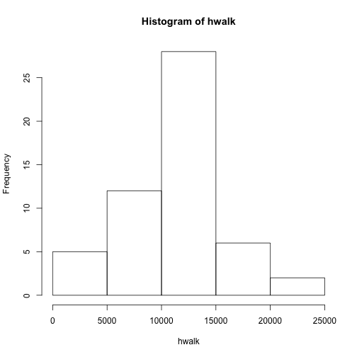
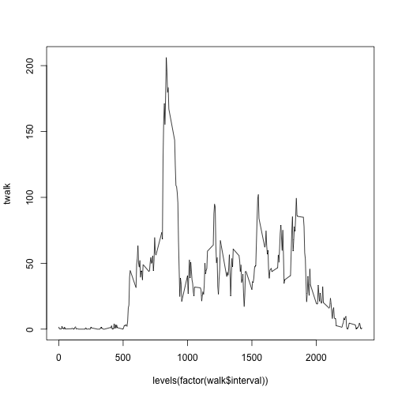
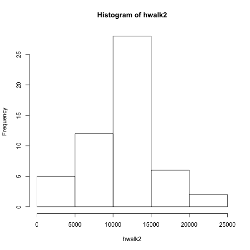
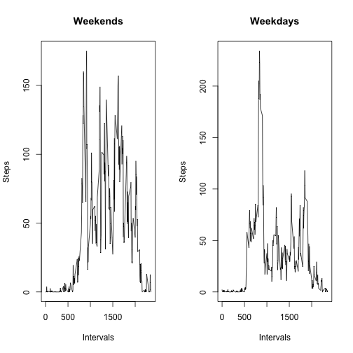

Peer Assessment Project 1- Reproducible Research
========================================================

This is an R Markdown document that will be used to completed Peer Assessment Project #1 for the Coursera Class "Reproducible Research."

The responses for this will be follow the evaluation tool inorder to more easily be evaluated by you, the evaluator.  Different sections will be identifed with astrixes (****).  

**** Reading and Processing  ****

This reads the .csv file into R and then (since the assignment asks us to ignore missing values), omits observations that have a NA value for steps.


```r
wal <- read.csv("activity.csv")
walk <- na.omit(wal)
```

**** Histogram  ****


```r
hwalk <- tapply(walk$steps, walk$date, sum)
hist(hwalk)
```

 


**** Mean and Median ****

Mean

```r
tapply(walk$steps, walk$date, mean)
```

```
## 2012-10-01 2012-10-02 2012-10-03 2012-10-04 2012-10-05 2012-10-06 
##         NA  0.4375000 39.4166667 42.0694444 46.1597222 53.5416667 
## 2012-10-07 2012-10-08 2012-10-09 2012-10-10 2012-10-11 2012-10-12 
## 38.2465278         NA 44.4826389 34.3750000 35.7777778 60.3541667 
## 2012-10-13 2012-10-14 2012-10-15 2012-10-16 2012-10-17 2012-10-18 
## 43.1458333 52.4236111 35.2048611 52.3750000 46.7083333 34.9166667 
## 2012-10-19 2012-10-20 2012-10-21 2012-10-22 2012-10-23 2012-10-24 
## 41.0729167 36.0937500 30.6284722 46.7361111 30.9652778 29.0104167 
## 2012-10-25 2012-10-26 2012-10-27 2012-10-28 2012-10-29 2012-10-30 
##  8.6527778 23.5347222 35.1354167 39.7847222 17.4236111 34.0937500 
## 2012-10-31 2012-11-01 2012-11-02 2012-11-03 2012-11-04 2012-11-05 
## 53.5208333         NA 36.8055556 36.7048611         NA 36.2465278 
## 2012-11-06 2012-11-07 2012-11-08 2012-11-09 2012-11-10 2012-11-11 
## 28.9375000 44.7326389 11.1770833         NA         NA 43.7777778 
## 2012-11-12 2012-11-13 2012-11-14 2012-11-15 2012-11-16 2012-11-17 
## 37.3784722 25.4722222         NA  0.1423611 18.8923611 49.7881944 
## 2012-11-18 2012-11-19 2012-11-20 2012-11-21 2012-11-22 2012-11-23 
## 52.4652778 30.6979167 15.5277778 44.3993056 70.9270833 73.5902778 
## 2012-11-24 2012-11-25 2012-11-26 2012-11-27 2012-11-28 2012-11-29 
## 50.2708333 41.0902778 38.7569444 47.3819444 35.3576389 24.4687500 
## 2012-11-30 
##         NA
```

Median

```r
tapply(walk$steps, walk$date, median)
```

```
## 2012-10-01 2012-10-02 2012-10-03 2012-10-04 2012-10-05 2012-10-06 
##         NA          0          0          0          0          0 
## 2012-10-07 2012-10-08 2012-10-09 2012-10-10 2012-10-11 2012-10-12 
##          0         NA          0          0          0          0 
## 2012-10-13 2012-10-14 2012-10-15 2012-10-16 2012-10-17 2012-10-18 
##          0          0          0          0          0          0 
## 2012-10-19 2012-10-20 2012-10-21 2012-10-22 2012-10-23 2012-10-24 
##          0          0          0          0          0          0 
## 2012-10-25 2012-10-26 2012-10-27 2012-10-28 2012-10-29 2012-10-30 
##          0          0          0          0          0          0 
## 2012-10-31 2012-11-01 2012-11-02 2012-11-03 2012-11-04 2012-11-05 
##          0         NA          0          0         NA          0 
## 2012-11-06 2012-11-07 2012-11-08 2012-11-09 2012-11-10 2012-11-11 
##          0          0          0         NA         NA          0 
## 2012-11-12 2012-11-13 2012-11-14 2012-11-15 2012-11-16 2012-11-17 
##          0          0         NA          0          0          0 
## 2012-11-18 2012-11-19 2012-11-20 2012-11-21 2012-11-22 2012-11-23 
##          0          0          0          0          0          0 
## 2012-11-24 2012-11-25 2012-11-26 2012-11-27 2012-11-28 2012-11-29 
##          0          0          0          0          0          0 
## 2012-11-30 
##         NA
```

**** Time series plot **** 


```r
twalk <- tapply(walk$steps, walk$interval, mean)
plot(levels(factor(walk$interval)), twalk, type = "l")
```

 

****  Point with maximum number of average (mean) steps per interval. **** 

To do this we used the which.max command.  The top is the begining of the interval and the section is the factor levlel associated with that interval.


```r
which.max(twalk)
```

```
## 835 
## 104
```

**** Imputing missing values. **** 

The decision has been made to input all missing values with the median daily value for that day.  However there is an issue.  For 8 days the median is NA.  This is because for those days there are NO measured values through out the day, and thus, after NA's have been omitted they have zero value.  To deal with that those days much first be removed from the data set:

To this end days that were found to be NA after NA values were removed were idetified.  The were then isolated.  The labels for these values were then found and subsetted out of the original dataframe (before removal of na's as done by na.omit during processing).

The dates that now were removed were subsequently removed as factors.


```r
swalk <- tapply(walk$steps, walk$date, median)
nswalk <- is.na(swalk)
toBeRemoved <- which(nswalk == TRUE)
brbr <- labels(toBeRemoved)
brbr
```

```
## [1] "2012-10-01" "2012-10-08" "2012-11-01" "2012-11-04" "2012-11-09"
## [6] "2012-11-10" "2012-11-14" "2012-11-30"
```

```r
walk2 <-wal
for(i in 1:8) {  
     walk2 <-subset(walk2, date != brbr[i])
     walk2
}
walk2$date <- as.factor(as.character(walk2$date))
walk <- walk2
```

Next the median of the remaining days was taken:


```r
tapply(walk$steps, walk$date, median)
```

```
## 2012-10-02 2012-10-03 2012-10-04 2012-10-05 2012-10-06 2012-10-07 
##          0          0          0          0          0          0 
## 2012-10-09 2012-10-10 2012-10-11 2012-10-12 2012-10-13 2012-10-14 
##          0          0          0          0          0          0 
## 2012-10-15 2012-10-16 2012-10-17 2012-10-18 2012-10-19 2012-10-20 
##          0          0          0          0          0          0 
## 2012-10-21 2012-10-22 2012-10-23 2012-10-24 2012-10-25 2012-10-26 
##          0          0          0          0          0          0 
## 2012-10-27 2012-10-28 2012-10-29 2012-10-30 2012-10-31 2012-11-02 
##          0          0          0          0          0          0 
## 2012-11-03 2012-11-05 2012-11-06 2012-11-07 2012-11-08 2012-11-11 
##          0          0          0          0          0          0 
## 2012-11-12 2012-11-13 2012-11-15 2012-11-16 2012-11-17 2012-11-18 
##          0          0          0          0          0          0 
## 2012-11-19 2012-11-20 2012-11-21 2012-11-22 2012-11-23 2012-11-24 
##          0          0          0          0          0          0 
## 2012-11-25 2012-11-26 2012-11-27 2012-11-28 2012-11-29 
##          0          0          0          0          0
```

And all medians were found to be zero.  As such remaining NA's were replaced with 0's.  While there are no more NA values that was accomplished by:


```r
walk2[is.na(walk2)] <- 0
```

****  Histogram of post-NA replacement **** 


```r
hwalk2 <- tapply(walk2$steps, walk2$date, sum)
hist(hwalk2)
```

 

****  Weekdays and Weekends **** 

Firstly we need to convert the date column to date.  Then assign them the day of the week.  Then create two data frames, ones with weekends days and one with week day days.  


```r
walk2$date <- as.Date(walk2$date)
walk2$wkdy <-weekdays(walk2$date)
walk2s <- subset(walk2, walk2$wkdy == "Sunday")
walk2ss <- subset(walk2, walk2$wkdy == "Saturday")
walk2weekends <- rbind(walk2s, walk2ss)
walk2m <- subset(walk2, walk2$wkdy == "Monday")
walk2t <- subset(walk2, walk2$wkdy == "Tuesday")
walk2w <- subset(walk2, walk2$wkdy == "Wednesday")
walk2th <- subset(walk2, walk2$wkdy == "Thursday")
walk2f <- subset(walk2, walk2$wkdy == "Friday")
walk2weekdays <- rbind(walk2m, walk2t, walk2w, walk2th, walk2f)
```

Then we need to find the averages and make the graphs.


```r
twalkwd <- tapply(walk2weekdays$steps, walk2weekdays$interval, mean)
twalkwe <- tapply(walk2weekends$steps, walk2weekends$interval, mean)

par(mfrow =c(1,2))
plot(levels(factor(walk2weekends$interval)), twalkwe, type = "l", main= "Weekends", xlab = "Intervals", ylab = "Steps")
plot(levels(factor(walk2weekdays$interval)), twalkwd, type = "l", main= "Weekdays", xlab = "Intervals", ylab = "Steps")
```

 
